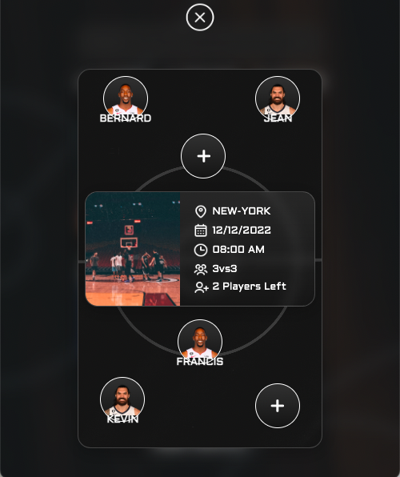

 

  <h1 align="center">Get Match</h1>

  

    Welcome to our basketball match-finding website! This project was created by four student developers from the Wild Code School as our first project using React.
     
     
    <a href="https://get-match.netlify.app/">View Demo</a>
  

## About The Project

Our website provides basketball enthusiasts with a platform to easily find or create games with other players in an USA area. You are already login as Michael, you can join a match, pick your preferred position, and set your availability. You can also search for games based on location, date, or create your own game and invite others to join.

## Built With

* [React](https://fr.reactjs.org/)

## Authors

* **Rémy Bernadin** - [Rémy](https://github.com/Remy-B-prog)
* **Lucas Fasilleau** - [Lucas](https://github.com/madashii)
* **Jonathan Bonhoure** - [Johnathan](https://github.com/SkullZRulZ)
* **Léon Versavel** - [Léon](https://github.com/Jesuisleon)

